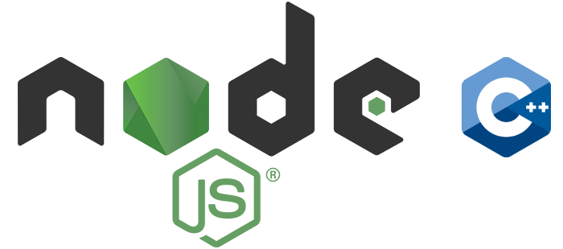

<p align="center">
  
  <br /> <br />
</p>

<h1 align="center">NodeJS C++ Addons</h1>

<p align="center">💪 This repository contains C++ Addons Examples for NodeJS.</p>

<p align="center">
  <a title="MIT License" href="LICENSE.md">
    
  </a>
  <a title="Twitter: JoseJ_PR" href="https://twitter.com/JoseJ_PR">
    
  </a>  
  <a title="Github: Sponsors" href="https://github.com/sponsors/JoseJPR">
    
  </a>
  <br />
  <br />
</p>

## 🔖 Description

The main idea is to document with examples and tips on how to create plugins with C ++ for NodeJS. C and C ++ were my first programming languages, I learned the basics with them and I am very fond of them (although I am rusty 😆).

## 🌍 Websites of Interest

- [NodeJS | C++ addons](https://nodejs.org/api/addons.html)
- [Github | Node.js native addon build tool](https://github.com/nodejs/node-gyp)
- [v8 API](https://v8docs.nodesource.com/node-15.0/)
- [C++ and Node.js: An Unholy Combination….But Oh So Right](https://benfarrell.com/2013/01/03/c-and-node-js-an-unholy-combination-but-oh-so-right/)
- [Tutorial C++](https://www.tutorialspoint.com/cplusplus/index.htm)

## 📌 Methodologies and Guidelines

Quality Assurance Code (QAC)

* ESTlint, tool for identifying and reporting on patterns found in ECMAScript/JavaScript code. \
  [NPM ESLint](https://www.npmjs.com/package/eslint) \
  [NPM ESLint | Airbnb](https://www.npmjs.com/package/eslint-config-airbnb)

## ✅ Prerequisites

In order to work with this project, your local environment must have at least the following versions:

* NodeJS Version: 14.xx
* NPM Version: 6.14.7

## 📐 How to work with this project

### Install NodeJS Dependences

```bash
$npm i
```

### Running the App

```bash
$node ./src/'folder'/'file.js'
```

## 📦 How to prepare and build a C++ Addons

### Install NodeJS Dependences

```bash
$mpn i -g node-gyp
```

### Generate the appropriate project build files.
```bash
$node-gyp configure
```

## Build the addon project.
```bash
$node-gyp build
```

## 📂 Code scaffolding

```any
/
├── assets 🌈                     # Images Sources.
├── env 🔌                        # Configure enviroments deploy.
├── src 💯
|   ├── hello-world               
|   |   ├── example01             # Show Hello word message.
|   |   └── example02             # Add colors and reset default color.
|   |
|   ├── data-types               
|   |   ├── example01             # Working with int, float and double.
|   |   ├── example02             # Working with char and char array.
|   |   ├── example03             # Working with string.
|   |   └── example04             # Working with bool.
|   |
|   ├── bucles               
|   |   ├── example01             # Working with bucle while.
|   |   ├── example02             # Working with bucle for.
|   |   ├── example03             # Working with bucle do while.
|   |   └── example04             # Working with nested loops.
|   |
|   ├── methods               
|   |   ├── example01             # Define two public method into the addons.
|   |   └── example02             # Define two public method and one internal.
|   |
|   ├── params               
|   |   ├── example01             # Get if param is number, string and the length.
|   |   └── example02             # WIP.
|   |
|   ├── returns               
|   |   ├── example01             # Return from addon to js the number of params.
|   |   ├── example02             # Return from addon to js the value of the param.
|   |   └── example03             # WIP.
|   └── ...
└── ...
```

## ⛽️ Review and Update Dependences

For review and update all npm dependences of this project you need install in global npm package "npm-check-updates" npm module.

```bash
# Install and Run
$npm i -g npm-check-updates
$ncu
```

## Happy Code

Created with JavaScript, lot of ❤️ and a few ☕️

## This README.md file has been written keeping in mind

- [GitHub Markdown](https://guides.github.com/features/mastering-markdown/)
- [Emoji Cheat Sheet](https://www.webfx.com/tools/emoji-cheat-sheet/)
